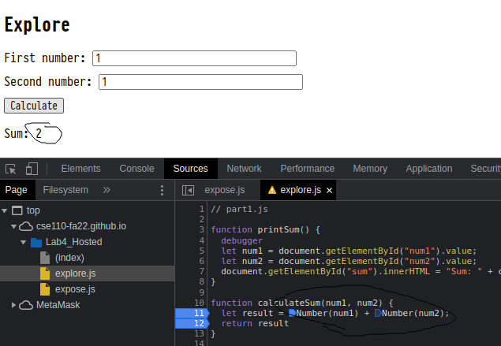

1. What was the bug?

`result` was storing the string concatenation of `num1` and `num2` rather than the numerical sum.

2. How would you fix it? Include a screenshot of your fix. Name it fix.png (or whatever image extension you would like to use)

I fixed it by doing a type conversion from string to number for `num1` and `num2` in the
`result`'s assignment expression.

